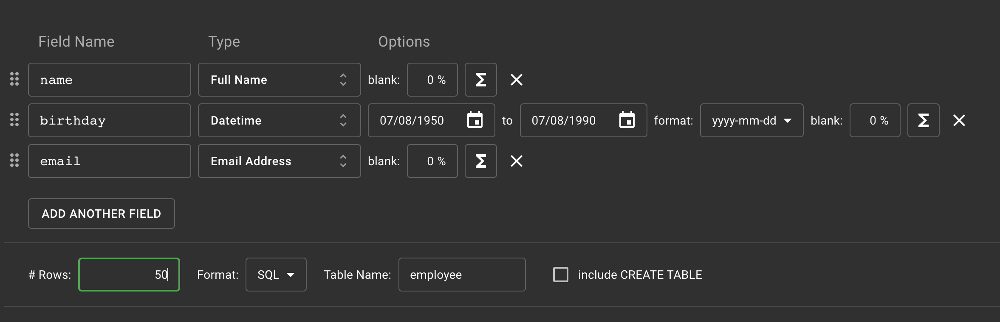

# Ödev 8
[Örnek SQL dosyası](./example.sql)
1. test veritabanınızda employee isimli sütun bilgileri id(INTEGER), name VARCHAR(50), birthday DATE, email VARCHAR(100) olan bir tablo oluşturalım.
```sql
CREATE TABLE employee(
	Id SERIAL PRIMARY KEY,
	name VARCHAR(50),
	birthday DATE,
	email VARCHAR(100)
)
```
2. Oluşturduğumuz employee tablosuna 'Mockaroo' servisini kullanarak 50 adet veri ekleyelim.

3. Sütunların her birine göre diğer sütunları güncelleyecek 5 adet UPDATE işlemi yapalım.
```sql
UPDATE employee
SET birthday = '1990-05-05'
WHERE name LIKE ('A%')
```
4. Sütunların her birine göre ilgili satırı silecek 5 adet DELETE işlemi yapalım.
```sql
DELETE FROM employee
WHERE name LIKE ('C%')
```